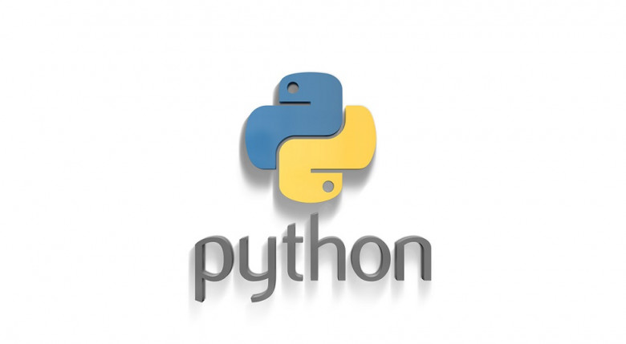

 
 


 
 


Читать на других языках: [English](README.md), [हिन्दी](README.hindi.md), [Russian](README.ru.md)

## CHROME 瀏覽器離線遊戲機器人

____


在自動模式下，在 windows 操作系統下啟動 Chrome 瀏覽器，也會自動檢測屏幕分辨率，
根據收到的數據，它找到主角 - 恐龍併計算響應區域。 我的個人
這個機器人的記錄是3119，但你覺得弱嗎？...

##如何安裝和運行
____
### 克隆存儲庫
 
```sh
$ cmd
$ git clone https://github.com/BEPb/python-bot
$ cd python-bot
```
 
### 安裝必要的包（安裝依賴）
```sh
$    -r requirements.txt
```
###關掉網絡，這個要確定，不然瀏覽器裡不會出現遊戲
### 運行我們的機器人
 
```sh
$ python bot_offline.py
```

機器人打開最後一頁並更新它，在沒有互聯網的情況下，遊戲打開。因為算法
 僅基於一個區域的定義，不考慮接近物體的速度增加
 是最佳的，當你輸了，遊戲會在 15 秒後重新開始，在輸掉之後。該程序本身提供了一個日誌
 文件，考慮到屏幕分辨率和每個遊戲的持續時間。
      
 對於手動選擇響應區域，還編寫了 draft.py 程序，它將執行所有相同的操作。
 啟動瀏覽器後，它將為您保存一個屏幕截圖，並在響應區域突出顯示黑色矩形。
 我非常詳細地描述了代碼，對於它的改進，這是唯一的歡迎。 Python 規則
 
____
