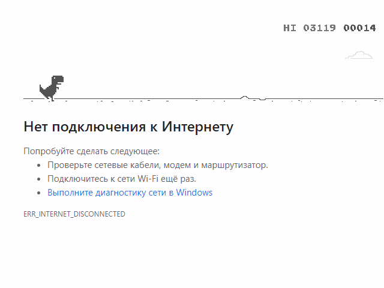

 
 


 
 


Read in other languages: [English](README.ru.md), [हिन्दी](README.hindi.md), [中國人](README.chinese.md)


## क्रोम ब्राउज़र ऑफलाइन गेम बॉट

____


स्वचालित मोड में, विंडोज़ ओएस के तहत क्रोम ब्राउज़र लॉन्च करता है, स्वचालित रूप से स्क्रीन रिज़ॉल्यूशन का भी पता लगाता है,
प्राप्त आंकड़ों के आधार पर, यह मुख्य चरित्र को ढूंढता है - एक डायनासोर और प्रतिक्रिया क्षेत्र की गणना करता है। मेरे निजी
इस बॉट के साथ रिकॉर्ड 3119 है, लेकिन आप कमजोर महसूस करते हैं? ....

## कैसे स्थापित करें और चलाएं
____
### रिपॉजिटरी को क्लोन करें
 
```sh
$ cmd
$ git clone https://github.com/BEPb/python-bot
$ cd python-bot
```
 
### आवश्यक पैकेज स्थापित करें (निर्भरता स्थापित करें)
```sh
$    -r requirements.txt
```
### इंटरनेट बंद कर दें, इस बात का ध्यान रखें, नहीं तो ब्राउज़र में गेम नहीं दिखेगा
### हमारा बॉट चलाएं
 
```sh
$ python bot_offline.py
```

बॉट अंतिम पृष्ठ खोलता है और इसे अपडेट करता है, इंटरनेट की अनुपस्थिति में, गेम खुल जाता है। क्योंकि एल्गोरिथम
  केवल एक क्षेत्र के आधार पर परिभाषाएँ, वस्तुओं के निकट आने की बढ़ती गति को ध्यान में नहीं रखते हैं
  इष्टतम है और जब आप हार जाते हैं, तो खेल 15 सेकंड के बाद, हारने के बाद फिर से शुरू होता है। कार्यक्रम ही एक लॉग के साथ प्रदान किया जाता है
  फ़ाइल, स्क्रीन रिज़ॉल्यूशन और प्रत्येक गेम की अवधि को ध्यान में रखते हुए।
      
  प्रतिक्रिया क्षेत्र के मैन्युअल चयन के लिए, ड्राफ्ट.पीई प्रोग्राम भी लिखा गया था, जो सभी समान जोड़तोड़ करेगा।
  ब्राउज़र लॉन्च करने पर, और फिर यह आपको प्रतिक्रिया क्षेत्र में हाइलाइट किए गए काले आयत के साथ एक स्क्रीनशॉट बचाएगा।
  उन्होंने कोड का बहुत विस्तार से वर्णन किया, इसके सुधार के लिए, यह केवल स्वागत योग्य है। पायथन नियम
____
