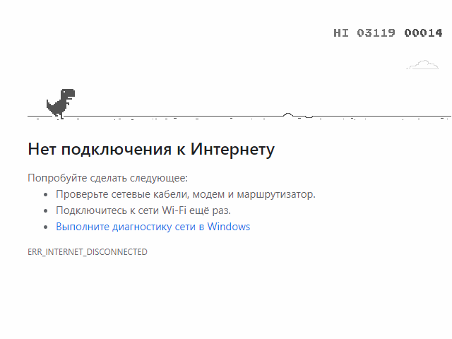
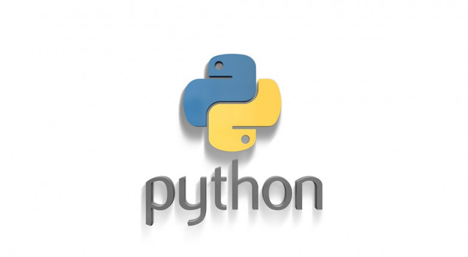

 
 


 
 


## Бот офлайн игры браузера CHROME

____


В автоматическом режиме запускает браузер Chrome под ОС windows, так же автоматически определяет разрешения экрана, 
на основании полученных данных находит главного героя - динозавра и производит расчет зоны реагирования. Мой личный 
рекорд при помощи этого бота 3119, а Вам слабо?....

## Порядок установки и запуска                    
____
### Клонируем репозиторий (Clone the repository)
 
```sh
$ cmd
$ git clone https://github.com/BEPb/python-bot
$ cd python-bot
```
 
### Устанавливаем необходимые пакеты (Install dependencies)
```sh
$    -r requirements.txt
```
### Отключаем интернет, убеждаемся в этом, иначе игра в браузрее не появится 
### Запускаем нашего бота 
 
```sh
$ python bot_offline.py
```

 Бот открывает последнюю страницу и обновляет ее, при отсутствии интернета открывается игра. Т.к. алгоритм 
 определения основанный только на одной зоне, не учитывающий увеличивающуюся скорость приближающихся объектов не 
 оптимален и при пройгрыше идет запуск  игры повторно через 15 секунд, после пройгрыша. Сама программа снабжено лог  
 файлом, учитывающая разрешение экрана и длительность каждой игры.
      
 Для ручного подбора зоны реагирования также написана программа draft.py, которая произведет все те же манипуляции по запуску браузера, а затем сохранит Вам скриншот с выделенной зоной реагирования черным прямоугольником.
 Очень подробно описывал код, для его улучшения, это только приветствуется. Питон рулит
 
____
