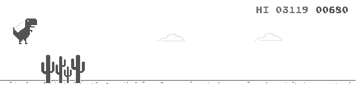

## Бот офлайн игры браузера CHROME

____


В автоматическом режиме запускает браузер Chrome под ОС windows, так же автоматически определяет разрешения экрана, 
на основании полученных данных находит главного героя - динозавра и производит расчет зоны реагирования. Мой личный 
рекорд при помощи этого бота 3119, а Вам слабо?....

## Порядок установки и запуска
____
### Клонируем репозиторий (Clone the repository)
 
```sh
$ cmd
$ git clone https://github.com/BEPb/python-bot
$ cd python-bot
```
 
### Устанавливаем необходимые пакеты (Install dependencies)
```sh
$ pip install -r requirements.txt / pipenv install
```
### Отключаем интернет, убеждаемся в этом, иначе игра в браузрее не появится 
### Запускаем нашего бота 
 
```sh
$ python bot_offline.py
```
